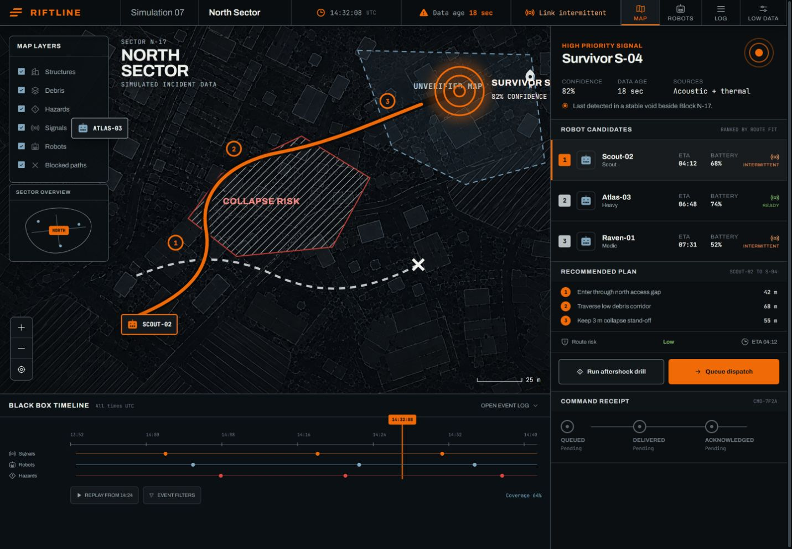

# RIFTLINE

RIFTLINE is an interactive command interface for coordinating rescue robots after an earthquake. It treats incomplete maps, stale telemetry, and unreliable links as operational facts instead of hiding them.

**Live prototype:** https://riftline-rescue-command.vercel.app



## The design response

The product is built around one urgent loop:

1. Detect a survivor signal and inspect its confidence and age.
2. See blocked paths, hazards, and unverified map areas together.
3. Compare robots by route fit, link quality, battery, and ETA.
4. Review the route and queue a command without pretending it was delivered.
5. Verify the command lifecycle in the event recorder.

The visual language takes its cue from a flight-data recorder: accountable, compact, and explicit about time. International orange marks the current decision. Red and green remain semantic and are always paired with words and shapes.

## Try the prototype

- Run the aftershock drill to expand the collapse zone and recompute the route.
- Queue dispatch while Scout-02 has an intermittent link.
- Switch to low-bandwidth mode to remove the heavy map texture while preserving critical geometry and controls.
- Select a robot on the map or in the ranked candidate list.
- Open the black-box timeline to inspect the causal event history.

Keyboard shortcuts: `A` toggles the aftershock drill, `F` opens the full fleet, and `L` opens the event log.

## Accessibility and resilience

- Semantic headings, landmarks, labels, fieldsets, lists, and live status messaging.
- Visible keyboard focus and 44px-class primary touch targets.
- Reduced-motion support for every non-essential transition.
- Color-independent status labels and route symbols.
- A dedicated mobile field view and persistent mobile command dock.
- Low-bandwidth map mode with all decision controls retained.
- No backend dependency. All data is visibly simulated for this competition prototype.

## Technology

- React 19 and TypeScript
- Vite
- Motion for causal state transitions and SVG route drawing
- Phosphor icon system
- Self-hosted Archivo and JetBrains Mono variable fonts
- Static Vercel deployment

## Local development

```bash
npm install
npm run dev
```

Production verification:

```bash
npm test
npm run build
```

## Product boundary

RIFTLINE is a UXcelerate competition prototype using simulated incident data. It has not been validated for real emergency deployment and does not claim institutional approval or measured rescue outcomes.
